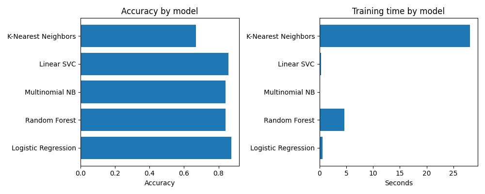
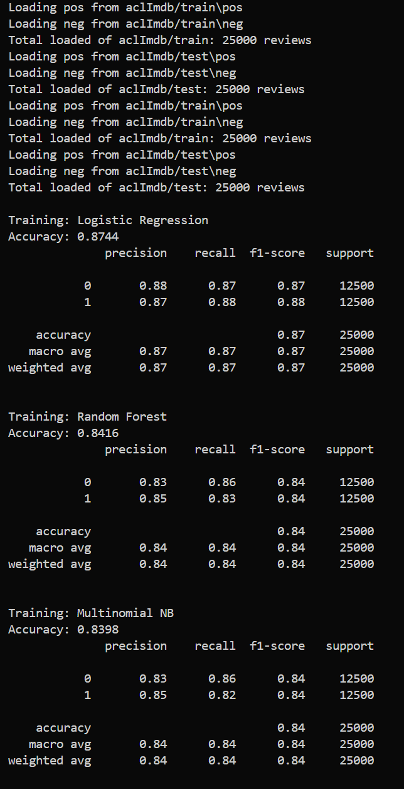
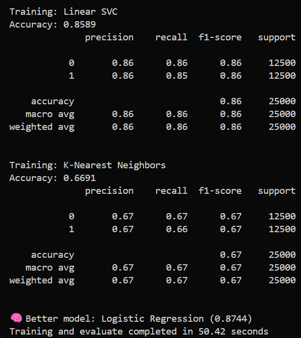

# 🎬 Sentiment Analysis on IMDb Movie Reviews

This project implements a sentiment analysis pipeline using the IMDb movie reviews dataset. The goal is to classify reviews as **positive** or **negative** based on their content, applying various machine learning models and natural language processing techniques.

---


## 📌 Project Overview

- 📂 Dataset: IMDb Movie Reviews
- 🧹 Text preprocessing: cleaning, stopword removal, and lowercasing
- 🧠 Vectorization: TF-IDF
- 🤖 Models compared:
  - Logistic Regression ✅ (best overall)
  - Random Forest
  - Multinomial Naive Bayes
  - Linear Support Vector Classifier (SVC)
  - K-Nearest Neighbors (KNN)
- 📈 Evaluation: Accuracy, Precision, Recall, F1-score
- 📊 Visualization: Bar charts comparing models by performance and training time

---

## 🧠 Results

- **Best model:** Logistic Regression
- **Test accuracy:** ~87%
- Logistic Regression provided the best balance between performance and training speed.

---

## 🚀 How to Run

1. Clone the repository:
   ```bash
   git clone https://github.com/cflg/Sentiment-Analysis-IMDb-reviews-.git
   cd Sentiment-Analysis-IMDb-reviews-
   ```
2. Create a virtual environment and activate it:
   ```bash
    python -m venv venv
    source venv/bin/activate  # On Windows: venv\Scripts\activate
   ```
3. Install dependencies:
   ```bash
    pip install -r requirements.txt
   ```
4. Run the notebook:
   ```bash
    jupyter notebook SentimentAnalysis.ipynb
   ```

## 📁 Project Structure

```text
📦 imdb-sentiment-analysis/
├── aclImdb/                    ← IMDb dataset (pos/neg reviews)
├── screenshots/                ← IMDb dataset (pos/neg reviews)
│  ├── 1.png                    ← Visualization: training time or results
│  ├── 2.png                    ← Visualization: training time or results
│  ├── negative_review.png.png  ← Visualization: negative review
│  ├── positive_review.png      ← Visualization: positive review
│  └── matplotlib_metrics.png   ← Visualization: accuracy or confusion matrix
├── SentimentAnalysis.ipynb     ← Main Jupyter notebook
├── main.py                     ← Pipeline script (load, preprocess, train, evaluate)
├── load_dataset.py             ← Dataset loading functions
├── preprocessing.py            ← Text cleaning functions
├── vectorization.py            ← TF-IDF vectorization logic
├── model.py                    ← Model training and evaluation
├── predict.py                  ← Predict sentiment from new text
├── print_results.py            ← Display formatted output and plots
├── model.joblib                ← Trained model (saved with joblib)
├── vectorizer.joblib           ← Saved TF-IDF vectorizer
├── requirements.txt            ← Project dependencies
├── README.md                   ← You are here!
└── .gitignore                  ← Git ignore rules
```

## 💡 Possible Improvements

- Add cross-validation and hyperparameter tuning
- Use word embeddings (Word2Vec, GloVe)
- Explore deep learning approaches (LSTM, BERT)
- Extend to other domains like product reviews or tweets

## 📜 License

This project is released under the MIT License.

## 🙌 Acknowledgments

    - IMDb dataset
    - Built using Python, scikit-learn, pandas, and Jupyter

## 🖼️ Screenshots & Visualizations

Below are some examples of the notebook's outputs and visualizations generated during the analysis:

### 📊 Model Accuracy Comparison



### ⏱️ Training Time Comparison




### 📝 Example Review Prediction

### Positive


### Negative


